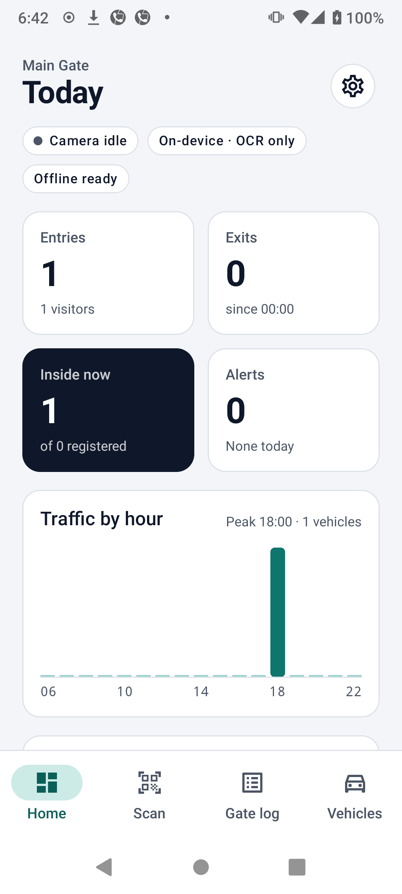
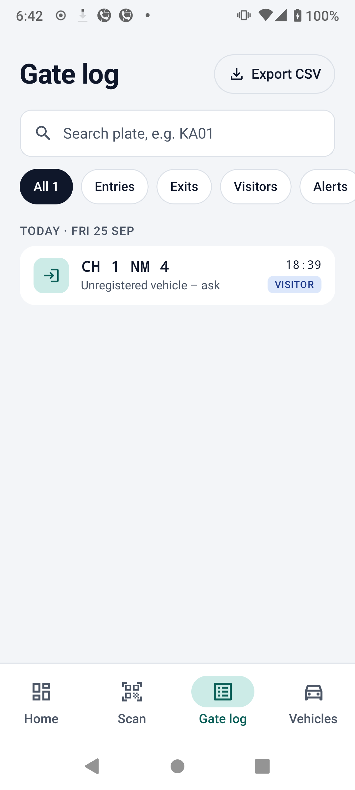
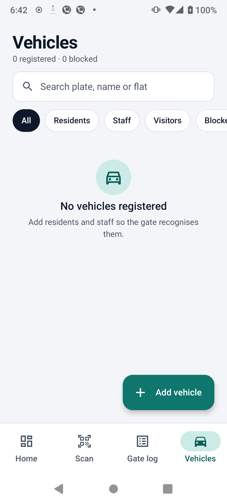

# EdgeGate ANPR — on-device vehicle number tracking for gates

An Android app that turns a phone at a society, campus or parking gate into an
**offline Automatic Number Plate Recognition (ANPR)** terminal. It reads plates with AI
running **on the phone itself (Edge AI)**, checks them against a local registry, tells the
guard *allow / visitor / deny*, and keeps a digital gate register. No server, no internet,
no per-camera cloud fees, and no video leaves the device.

```
CameraX frame ─▶ LiteRT YOLOv8n plate detector (GPU ▸ CPU fallback)
             ─▶ crop + upscale ─▶ ML Kit on-device OCR
             ─▶ PlateNormalizer (Indian plate grammar, fixes 0/O 8/B 5/S …)
             ─▶ TemporalVoter (3+ frames must agree)
             ─▶ GateDecisionEngine (resident / visitor / blacklist, entry / exit, cooldown)
             ─▶ Room DB (gate log, registry) ─▶ Compose UI + alarm + CSV export
```

<p>
  
  
  
</p>

## Modules

| Module | What | Why separate |
|---|---|---|
| `core/` | Pure Kotlin: plate grammar + correction, multi-frame voting, YOLO decode + NMS, gate rules, latency stats, CSV | Testable on the JVM in milliseconds; the AI-independent logic is where most bugs hide |
| `app/` | Android: CameraX, LiteRT, ML Kit, Room, Jetpack Compose | Platform + hardware |
| `ml/` | Python: train YOLOv8n, export INT8/FP32 LiteRT (.tflite), benchmark | Model lifecycle |

## Run it

1. Open the folder in Android Studio (Ladybug or newer), let Gradle sync.
2. Run on a physical phone (emulators have no useful camera).
3. **Works with no model file**: ML Kit OCR runs on the full frame.
4. For the full two-stage pipeline, train a detector (`ml/train_and_export.py`) and copy it to
   `app/src/main/assets/plate_detector.tflite`. The HUD will switch to `LiteRT · GPU` or `LiteRT · CPU×4`.

```bash
./gradlew :core:test          # 28 unit tests: plate parsing, voting, decoding, gate rules, day stats
./gradlew :app:installDebug
```

## Screens (v1.1 design)

| Screen | What it shows |
|---|---|
| **Home** | KPI cards (entries, exits, inside now, alerts), traffic-by-hour chart, recent activity, live AI engine health |
| **Scan** | Full-bleed dark camera, viewfinder, live plate box + read, Entry/Exit/Auto segmented control, torch, latency HUD, and a bottom decision sheet (Allow / Visitor / Deny with alarm, silence and call-supervisor) |
| **Gate log** | Search, filters (entries, exits, visitors, alerts), day-grouped register with sticky headers, CSV export |
| **Vehicles** | Search, category filters, cards with initials, category badge and block switch, "Add vehicle" |
| **Register vehicle** | Live plate validation with a plate preview and state name, category picker, blacklist toggle |
| **Settings** | Gate name, default mode, GPU, frames to confirm, cooldown, alarm/beep, supervisor phone, log retention |

Design system: `ui/theme` (colour tokens, type scale, shapes, spacing) and `ui/components`
(PlateChip, badges, cards, search, filter pills). Brand fonts (Space Grotesk, IBM Plex Sans/Mono)
are optional; see `ui/theme/Type.kt` for the two-step switch.

## Privacy by design

No `INTERNET` permission. Frames are processed in memory and discarded; only the plate
text, time and decision are stored. `allowBackup=false` keeps the register out of cloud backups.

## Documentation

- **[How it works](https://chinmay4github1987.github.io/EdgeGate-ANPR/)**: a mobile-friendly page for guards, admins and anyone new to the project
- **[Project documentation](docs/PROJECT_DOCUMENTATION.md)**: why it exists, deployments, architecture, Edge AI integration, code walkthrough, data model, training, testing and roadmap
- **[UI design reference](design/claude-design/)**: the Claude Design mockups the Compose screens were built from
