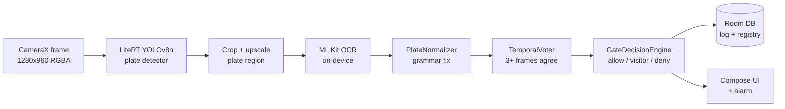
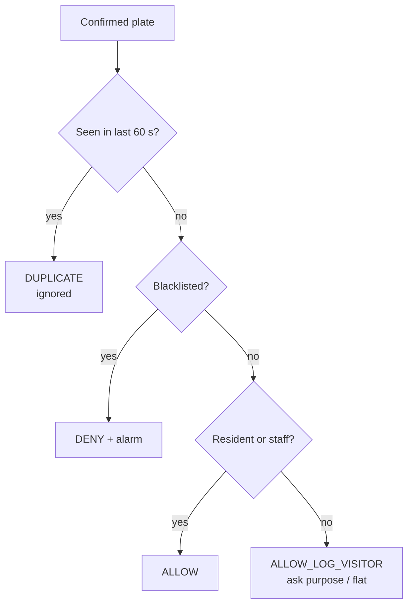

# EdgeGate ANPR – Project Documentation

EdgeGate turns an ordinary Android phone at a gate into an offline number-plate reader. It detects and reads vehicle plates with AI running on the phone itself, checks each plate against a local registry, tells the guard to allow, log as a visitor or deny, and keeps a searchable digital gate register. No server, internet connection or cloud fee is needed.

> A mobile-friendly overview for non-developers is on the [How it works page](https://chinmay4github1987.github.io/EdgeGate-ANPR/).

## Why we need this application

Most Indian apartment societies, offices and parking lots still track vehicles in a handwritten register. That process is slow, error-prone and impossible to search.

- **Queues at peak hours.** Stopping every vehicle so the guard can write the plate by hand means morning and evening rush creates tailbacks onto the road.
- **Unreliable records.** Handwriting is illegible, entries are skipped when the guard is busy, and nobody can answer "when did KA 01 AB 1234 leave on Tuesday?" without flipping pages.
- **No real-time security.** A blacklisted or suspicious vehicle is only caught if the guard happens to remember the plate.
- **Commercial ANPR is expensive.** Dedicated ANPR cameras plus a cloud subscription cost far more than a small society or a single parking lot can afford, and they depend on stable internet.
- **Privacy concerns.** Cloud systems upload continuous video of residents and visitors to someone else's server.

EdgeGate solves this with a phone the site already owns. The AI runs on the device (Edge AI), so it works without internet, answers in well under a second, costs nothing per camera per month, and keeps video on the phone.

## Where it can be deployed and who uses it

The primary target is a gated entry point where a guard already checks vehicles. The same app works anywhere a phone can see the plate at walking speed.

| Deployment | End users | What they get |
| --- | --- | --- |
| Apartment societies / gated communities | Security guards, facility manager, RWA committee, residents | Automatic resident recognition, visitor log, blacklist alerts, daily register export |
| Corporate offices and IT parks | Security team, admin / facilities | Employee vs visitor vehicles, occupancy (vehicles inside now), audit trail |
| Paid or private parking lots | Parking attendant, lot owner | Entry/exit times per plate as the basis for billing and dwell time |
| Hospitals, colleges, hotels | Front-gate security, admin | Staff vs visitor separation, quick search when a vehicle must be traced |
| Factories and warehouses | Gate security, logistics supervisor | Truck in/out log, gate turnaround time, blocked vendor vehicles |
| Township or event entrances | Temporary security staff | A cheap, fast deployment on any mid-range phone with no internet |

**Primary end user: the gate guard.** The guard needs one large, colour-coded answer (green allow, blue visitor, red deny) plus an alarm they can hear. Guards may not be comfortable with complex software, so the scan screen needs zero typing in the normal case and offers manual entry as a fallback.

**Secondary users: the administrator** (society secretary, facility or parking manager). The administrator registers vehicles, maintains the blacklist, and exports the day's register as CSV to WhatsApp, email or Drive.

It is not meant for traffic enforcement or tracking people across a city. Treat it as an access-control register for private premises that already record vehicles by hand.

## Architecture

Each camera frame passes through four AI and logic stages. Only a confirmed plate reaches the business rules and the database.



If no detector model is bundled, the app skips the detector and runs OCR on the full frame. The grammar filter then picks the plate out of all the text it sees. The app therefore works on first install, and adding a trained model upgrades it.

The project is split into three modules so that the AI, the rules and the platform can change independently.

| Module | Language | Responsibility | Depends on Android? |
| --- | --- | --- | --- |
| `core/` | Kotlin (JVM) | Plate grammar + OCR correction, multi-frame voting, YOLO decoding + NMS, gate rules, latency stats, CSV export | No, unit-tested on the JVM |
| `app/` | Kotlin, Jetpack Compose | CameraX capture, LiteRT inference, ML Kit OCR, Room storage, UI, alerts | Yes |
| `ml/` | Python | Train YOLOv8n, export INT8/FP32 LiteRT models, benchmark variants | No |

The app layers follow standard Android architecture: UI (Compose screens) → ViewModels (StateFlow) → Repository → Room DAOs. A small manual DI container in `EdgeGateApp` wires them together, so the project does not need Hilt.

## How Edge AI is integrated

The app uses two on-device models and two pieces of domain logic. Each one answers a specific Edge AI constraint: limited compute, limited memory, no network, and the need for predictable latency.

### 1. Plate detection – LiteRT (TensorFlow Lite) + YOLOv8n

- **Model:** YOLOv8 "nano" (about 3 million parameters) trained on one class, `plate`, at 320×320 input. At 320 px the model does about a quarter of the work it does at 640 px. At a gate the car is close, so the plate is still large enough to detect.
- **Runtime:** LiteRT, Google's new name for TensorFlow Lite. The `.tflite` file is stored uncompressed in the APK (`noCompress += "tflite"`) and memory-mapped, so the weights are never copied into the Java heap.
- **Hardware acceleration with fallback:** `LiteRtPlateDetector.createOrNull()` checks the GPU `CompatibilityList`. It uses the **GPU delegate** if the device is supported and otherwise falls back to **multi-threaded CPU with XNNPACK**. The active runtime is shown on the scan screen ("LiteRT · GPU" or "LiteRT · CPU×4").
- **Quantisation-aware I/O:** the detector reads each tensor's data type and quantisation parameters (scale, zero point) at runtime, so the same code runs FP32, FP16 and INT8 exports. It also detects the input layout: NHWC from older TFLite exports, or NCHW from Ultralytics' newer direct LiteRT export. INT8 makes the model about 4× smaller than FP32 and usually faster on CPUs and NPUs.
- **Zero-allocation loop:** input and output buffers are allocated once and reused for every frame. This avoids garbage-collection pauses and keeps latency stable.
- **Thread affinity:** a GPU delegate must be created, used and closed on one thread. `PlateAnalyzer` therefore builds the pipeline lazily on the camera analysis thread and closes it there.
- **Post-processing in pure Kotlin:** `YoloDecoder` (in `core/`) decodes the `[1, 5, N]` output and runs non-maximum suppression. It is unit-tested without a device.

### 2. Character reading – ML Kit Text Recognition (bundled)

- The bundled Latin recogniser ships inside the APK, so OCR works offline from first launch with no model download.
- OCR runs only on the **padded plate crop**, not the whole frame. The crop is upscaled to at least 96 px high because small text reads poorly.
- Lines are sorted top to bottom, so two-row plates (bikes, trucks) are joined in reading order.

### 3. Domain-aware correction – `PlateNormalizer`

Small OCR models confuse shapes: 0/O, 8/B, 5/S, 1/I, 2/Z. Rather than shipping a bigger model, the app uses the Indian plate grammar. It knows which positions must be letters and which must be digits, and fixes the character in under a millisecond with no extra model compute.

- Standard format `SS RR XXX NNNN`, for example KA 01 AB 1234, MH 12 DE 0045 and DL 3C AB 1234
- Bharat series `YY BH NNNN XX`, for example 22 BH 1234 AA
- Validates the state code against the RTO list, strips the "IND" hologram text, and prefers an exact read over a corrected one

### 4. Multi-frame consensus – `TemporalVoter`

One frame can be blurred, glared or half hidden. The camera delivers many frames per second, so the app confirms a plate only when **at least 3 reads within 2 seconds agree** and hold at least 60% of the confidence-weighted votes. The same plate is not emitted again until it has been out of view for 3 seconds. This spends extra frames rather than extra compute to improve accuracy.

### Why on-device instead of cloud?

| Concern | Cloud ANPR | EdgeGate (on-device) |
| --- | --- | --- |
| Internet outage | Gate stops working | Unaffected |
| Latency | Network round trip + server queue | Local inference only |
| Running cost | Per-camera / per-call fees + bandwidth | None after install |
| Privacy | Video leaves the premises | Frames discarded in memory; only plate text stored |
| Hardware | IP camera + server or subscription | Any mid-range Android phone |

## Source code walkthrough

Package: `com.chinmay.edgegate`.

| File | Layer | Job |
| --- | --- | --- |
| `core/.../PlateNormalizer.kt` | Core logic | Cleans OCR text, tries every legal plate layout, fixes letter/digit confusion by position, validates state code, formats for display |
| `core/.../TemporalVoter.kt` | Core logic | Confidence-weighted multi-frame voting; emits a plate once per vehicle pass |
| `core/.../YoloDecoder.kt` | Core logic | Decodes YOLOv8 output (channels-first or last, pixel or normalised coordinates) and runs NMS |
| `core/.../GateDecisionEngine.kt` | Core logic | Blacklist → deny; resident/staff → allow; others → visitor log; entry/exit/auto direction; 60 s duplicate cooldown |
| `core/.../RollingStats.kt` | Core logic | Rolling mean and p50/p90 latency for the live HUD |
| `core/.../CsvExporter.kt` | Core logic | RFC 4180 CSV with spreadsheet formula-injection guard |
| `app/.../ai/PlateDetector.kt` | Edge AI | LiteRT interpreter, GPU delegate with CPU/XNNPACK fallback, INT8/FP32 I/O, buffer reuse |
| `app/.../ai/PlateOcr.kt` | Edge AI | ML Kit bundled text recogniser, synchronous on the analysis thread |
| `app/.../ai/AnprPipeline.kt` | Edge AI | Orchestrates detect → crop/upscale → OCR → normalise → vote; times each stage |
| `app/.../camera/PlateAnalyzer.kt` | Camera | CameraX analyzer; rotates frames, builds the pipeline on its own thread, survives bad frames |
| `app/.../camera/CameraPreview.kt` | Camera | Binds Preview + ImageAnalysis (4:3, 1280×960, KEEP_ONLY_LATEST) to the lifecycle |
| `app/.../data/db/*.kt` | Data | Room entities (`vehicles`, `gate_events`), DAOs, "inside now" query |
| `app/.../data/GateRepository.kt` | Data | Single source of truth; maps entities to core models; CSV export |
| `app/.../ui/scan/*` | UI | Camera, plate box, live read, latency HUD, gate mode, decision sheet, manual entry |
| `app/.../ui/dashboard/DashboardScreen.kt` | UI | KPI cards, traffic by hour, recent activity, AI engine health |
| `app/.../ui/log/LogScreen.kt` | UI | Search, filters, day-grouped register, CSV share |
| `app/.../ui/vehicles/*` | UI | Registry list, register vehicle form, blacklist switch |
| `app/.../util/Alerter.kt`, `Settings.kt` | Util | Alarm tone + vibration on deny; persisted settings as a StateFlow |
| `ml/train_and_export.py` | ML | Train YOLOv8n at 320 px, export INT8 + FP32 LiteRT (.tflite) models |
| `ml/benchmark_tflite.py` | ML | Size, dtypes and p50/p90 latency per exported variant |

### How one frame flows through the code

1. `CameraPreview` delivers an `ImageProxy` to `PlateAnalyzer.analyze()` on a single background thread. If inference is still busy, older frames are dropped.
2. `PlateAnalyzer` converts it to a `Bitmap`, rotates it upright and calls `AnprPipeline.process()`.
3. The pipeline runs `LiteRtPlateDetector.detect()`, crops the best box, calls `PlateOcr.read()`, then `PlateNormalizer.bestFromLines()` and `TemporalVoter.offer()`.
4. `ScanViewModel.onFrame()` updates the HUD. When the voter returns a `Consensus`, it launches `confirm()`.
5. `confirm()` loads the vehicle profile and last direction from Room, asks `GateDecisionEngine.decide()`, writes a `gate_events` row, sounds the alert and shows the decision card.

## User interface and design system (v1.1)

The UI looks like a calm security console: a cool neutral background, one teal accent for actions, and three status colours used only for gate decisions. Each status colour always comes with an icon and a word, so colour-blind guards can read it. The design mockups for every screen are in [`design/claude-design`](../design/claude-design/).

| Screen | Purpose | Key elements |
| --- | --- | --- |
| Home | Overview for the admin and guard | KPI cards (entries, exits, inside now, alerts), traffic-by-hour chart, recent activity, live AI engine health |
| Scan | The guard's working screen | Full-bleed dark camera, viewfinder, live plate box, Entry/Exit/Auto control, torch, latency HUD, bottom decision sheet |
| Scan · deny | Blacklisted vehicle | Red camera frame, alarm banner, Silence alarm and Call supervisor actions |
| Gate log | Searchable register | Search, filters (entries, exits, visitors, alerts), day-grouped list, CSV export |
| Vehicles | Registry | Search, category filters, cards with initials, badge and block switch |
| Register vehicle | Add a plate | Live validation with plate preview and state name, category picker, blacklist toggle |
| Settings | Configuration | Gate name, default mode, GPU, frames to confirm, cooldown, alerts, supervisor phone, log retention |

**Design tokens in code:** `ui/theme/Color.kt` (palette and semantic `EdgeColors` for light and dark), `Type.kt` (type scale and plate styles), and `Theme.kt` (shapes with radii of 12, 16 and 24 dp, a 4 dp spacing grid). Reusable pieces live in `ui/components/Components.kt`: PlateChip, action and category badges, cards, search field, filter pills, empty states and status pills.

**Design decisions**

- Fixed brand colours instead of Material You dynamic colour. Allow, Visitor and Deny must look the same on every phone, so guards learn them once.
- The number plate is drawn like a real high-security plate (white, black border, blue IND strip) so it is recognisable at a glance, even in dark theme.
- The Scan screen is always dark. That cuts glare at night and makes the camera image the focus. The decision appears as a bottom sheet, so the guard's eyes move once, from car to sheet.
- Every tap target is at least 44–48 dp. Filters and mode controls use real selectable or radio semantics, so TalkBack reads them correctly.
- Settings are a StateFlow. Changing the cooldown, alarm or default mode takes effect immediately without restarting the app. Detector changes apply the next time Scan opens.
- Brand fonts (Space Grotesk, IBM Plex Sans and Mono) are optional and switched in one file. The app uses system fonts until the TTFs are added.

## Data model and gate rules

Two Room tables hold everything. The plate in canonical form (for example `KA01AB1234`) is the join key.

| Table | Key fields | Purpose |
| --- | --- | --- |
| `vehicles` | plate (PK), display, category (RESIDENT / STAFF / VISITOR), blacklisted, ownerName, unit, phone | The registry the admin maintains |
| `gate_events` | id, plate, direction (ENTRY / EXIT), action, category, confidence, source (AI / MANUAL), latencyMs, note, timestamp | The digital gate register; indexed on plate and timestamp |

**Vehicles inside now** is the count of plates whose latest non-denied event is an ENTRY.



**Direction:** on an entry-only or exit-only lane, the direction is fixed. In **Auto** mode, one phone covers a shared gate: a vehicle whose last event was ENTRY is logged as EXIT, otherwise as ENTRY.

The rules live in `GateDecisionEngine`, separate from the AI. A society can add a rule such as "visitors need approval after 10 pm" without retraining or re-validating any model.

## Build, run and train the model

### Run the app

1. Clone the repository and open it in Android Studio (Ladybug or newer). Let Gradle sync; dependency versions are in `gradle/libs.versions.toml`.
2. Run `./gradlew :core:test` to execute the unit tests.
3. Connect a physical Android 8.0+ phone and run `./gradlew :app:installDebug` (or the `app` configuration). Emulators do not have a usable camera.
4. Grant camera permission, choose **Entry**, **Exit** or **Auto**, and point the camera at a plate from 2–5 m.
5. Add a few vehicles in the **Vehicles** tab and blacklist one to see all three decision colours.

Without a model file, the HUD shows "ML Kit OCR · full frame (no detector)". This mode is good enough for a demo.

### Train and add the detector

```bash
cd ml
pip install -r requirements.txt
# put images + YOLO labels under datasets/plates (see plates.yaml)
python train_and_export.py --data plates.yaml --epochs 80 --imgsz 320
python benchmark_tflite.py exports/*.tflite
cp exports/plate_detector_int8.tflite ../app/src/main/assets/plate_detector.tflite
```

- **Data:** combine a public Indian ANPR dataset (check its licence) with a few hundred frames from the actual gate. Label only the plate box. Include night, rain, glare, two-row plates and tilted angles.
- **Augmentation:** brightness and small rotations are on. Horizontal flip is **off**, because mirrored text teaches the model the wrong thing.
- **Pick a variant:** start with INT8. If recall drops more than 1–2 points compared with FP32, ship the FP32 file and run it on the GPU delegate, which computes in FP16 internally. Ultralytics 8.4.83 and later export with `format="litert"` (`quantize=8` for INT8); the script falls back to the older `format="tflite"` automatically.
- **Confirm on device:** the scan-screen HUD shows detect and OCR p50 and frame p90. For a controlled benchmark, use Google's `benchmark_model` over `adb` as described in `benchmark_tflite.py`.

### Production checklist

- [ ] Mount the phone at plate height, 2–5 m from the stop line, angled 15° or less, and shaded from direct sun
- [ ] Keep it on permanent power, disable battery optimisation for the app and use screen pinning (kiosk)
- [ ] Add an IR illuminator for night if the phone camera struggles with headlight glare
- [ ] Put up a signboard saying vehicle numbers are recorded, and set a retention period for logs

## Performance targets and testing

The numbers below are **design targets for a mid-range phone**, not measured results. Record your own device's figures from the HUD.

| Metric | Target | Where to read it |
| --- | --- | --- |
| Detector latency (320 px, INT8/FP16) | p50 under 30 ms | HUD "detect p50" |
| OCR latency on plate crop | p50 under 60 ms | HUD "ocr p50" |
| End-to-end per frame | p90 under 150 ms | HUD "frame p90" |
| Time from vehicle stop to decision | under 1 s (3 voting frames) | Stopwatch / event timestamps |
| Plate-level accuracy after voting | 95%+ on daytime test clips | Replay labelled clips, compare with ground truth |
| Detector model size | about 3 MB INT8 | `benchmark_tflite.py` |

### Tests included

28 JVM unit tests in `core/src/test` cover the logic most likely to break:

- **PlateNormalizer (10):** clean plates, punctuation, positional O→0 / 8→B / I→1 fixes, IND strip, Delhi single-digit RTO, Bharat series, invalid state, random shop text, two-row plates, and preferring an exact read
- **TemporalVoter (5):** confirmation threshold, outlier rejection, no repeat while in view, re-arming, window expiry
- **GateDecisionEngine (5):** resident allow, blacklist deny, unknown visitor, auto direction, 60 s cooldown
- **YoloDecoder (3):** thresholding, pixel/transposed outputs, NMS
- **GateStats (3):** dashboard day statistics and state names
- **Utilities (2):** percentiles, CSV escaping and formula-injection guard

The Android module builds with `./gradlew :app:assembleDebug` and has been installed and launched on a Redmi Note 10 (Android 11).

### Recommended next tests

- Instrumented Room DAO tests, especially for the "inside now" query
- A replay harness that feeds recorded MP4 clips through `AnprPipeline` to measure plate accuracy per lighting condition
- CPU vs GPU delegate comparison on 2–3 phones: p50, p90, battery drain per hour and device temperature

## Privacy, limitations and roadmap

**Privacy by design.** The app does not request the `INTERNET` permission. Frames are processed in memory and then discarded. Only the plate text, time, direction and decision are stored. `allowBackup=false` keeps the register out of cloud backups. Because plates and phone numbers are personal data, anyone who deploys the app should follow India's Digital Personal Data Protection Act, 2023: tell people with signage, collect only what is needed and delete logs after a set period. This is general information, not legal advice.

**Known limitations**

- Accuracy drops at night, in heavy rain, with dirty or non-standard (fancy font) plates, and at speeds above walking pace
- One phone watches one lane. Two lanes need two phones or Auto mode at a single choke point
- The registry is local to each phone, so a multi-gate site needs a sync step (see roadmap)
- The stretch resize in the detector is simple. Letterboxing usually recovers a little recall on wide plates

**Roadmap**

| Next step | Why |
| --- | --- |
| Optional encrypted sync of the registry and log between gates (WorkManager + a small backend) | Multi-gate campuses and an admin web dashboard |
| Custom plate OCR model (CRNN/PARSeq, INT8) trained on Indian plates | Better accuracy on two-row and non-standard plates than a general OCR model |
| NPU acceleration via LiteRT's newer accelerator APIs or the Qualcomm/MediaTek delegates | Lower latency and power on phones with an NPU |
| Boom-barrier trigger over Bluetooth/relay for registered residents | Hands-free entry |
| Resident pre-approval of visitors (share a plate + time window) | Removes the phone call from the guard to the flat |
| Replay-based evaluation harness + drift monitoring | Evidence that accuracy holds as conditions change |
